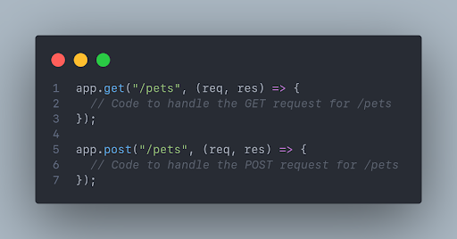

### Introduction to REST APIs 🤖

Introduction to REST APIs and CRUD Operations with Express JS (Day 4)

### Lesson Outcome

By the end of today, you should be able to:

1. Understand the concept of REST APIs and their role in web development.

2. Learn about the advantages of using RESTful architecture for building APIs.

3. Understand the common HTTP methods used in RESTful APIs. (GET, POST, PUT, DELETE)

4. Understand the principles of CRUD operations (Create, Read, Update, Delete) in RESTful APIs.

5. Learn how to use Express.js as a framework for building RESTful APIs.

### HTTP and REST

HTTP (Hypertext Transfer Protocol) is the foundation of communication on the World Wide Web. It is a protocol that enables clients (such as web browsers) to send requests to servers and receive responses. Understanding HTTP is essential when working with RESTful APIs.

REST (Representational State Transfer) is an architectural style for designing server-side applications. They are resource-oriented, meaning that they expose resources that clients can interact with. Resources can represent entities such as users, products, or documents. Each resource is identified by a unique URL, also known as an API endpoint.

### HTTP Methods

To interact with resources, clients use HTTP methods, also known as verbs. The most commonly used methods are:

- GET: Get resource or a collection of resources.
- POST: Create a new resource.
- PUT: Update an existing resource.
- DELETE: Delete a resource.

There's an easier way to remember these methods. Think of them as the CRUD operations (Create, Read, Update, Delete) on resources.


### API Endpoints

API endpoints are specific URLs that clients can use to access and manipulate resources through a RESTful API. Endpoints define the operations that can be performed on resources and the expected response format.

Endpoints typically follow a precise structure, where the base URL represents the API root, followed by entities in the URL representing different resources or actions.


In the example above, the base URL is `/api/pets`. The `/api` part is the API root, and the `/pets` part represents the pets resource. You might notice that the last three endpoints have a path parameter (`:id`) at the end. This is known as a path parameter, and it is used to identify a specific resource. For example, the endpoint GET `/api/pets/1` will return the pet with ID 1. Path parameters are dynamic and can be used to retrieve a specific resource by ID.

Other than path parameters, query parameters are also commonly used in API endpoints. Commonly used to filter, sort, or paginate results. For example, `GET /api/pets?limit=10&sort=asc` will return the first 10 pets sorted in ascending order.


API endpoints play a critical role in defining the available resources and actions in a RESTful API. They provide a structured and predictable way for clients to interact with the API and perform various operations on the resources.

### What is Express?

Express.js is a popular web application framework for Node.js. Commonly used for building RESTful APIs and server-side applications. It provides a good set of features and tools for building robust and scalable applications making it a popular choice among developers.

### Here are some reasons why developers choose Express

1. Shortened Development in Server Side: The frameworks provides features of node.js along with ready made libraries without the need to reinvent the wheels every time.
2. Templating Engine: ExpressJS supports multiple template engine that allows you to serve static template files. It also supports application generator tools that creates an application skeleton for you automatically.
3. Routing: ExpressJS supports route configuration that let you specify your own endpoint to serve your data.
4. Middleware: On top of the routing feature, it lets you inserts middleware before the request reach their respective route. This makes it easier to implementing authentication or authorization checks and enables logging. You can even chain multiple business logics together with this feature.
5. Debug module: ExpressJS also comes with a debug module to log information regarding matching routes, middleware functions, application mode and the whole flow from request until response. It also comes with their own default error handler.

### Creating an Express App

Since Express is a Node.js framework, we need to set up a Node.js application before we can use Express. To create a Node.js app, follow these steps:

Create a new directory called my-first-express-app and navigate to it.

```sh
mkdir my-first-express-app
cd my-first-express-app
```

Open a terminal or command prompt and initialize a new Node.js project by running the command npm init -y.

```sh
npm init -y
```

Once that is done, you can install the Express.js, by running the command npm install express.

```sh
npm install express
```


### Initializing an Express.js App

To create an Express.js app, create a new file called index.js and copy-paste the following code:

```js
const express = require("express");
const app = express();

const pets = [
  { id: 1, name: "Max", type: "dog" },
  { id: 2, name: "Angel", type: "cat" },
  { id: 3, name: "Buddy", type: "dog" },
  { id: 4, name: "Daisy", type: "cat" },
];

app.get("/", (req, res) => {
  res.send("Hello World!");
});

app.get("/pets", (req, res) => {
  res.send(pets);
});

app.listen(3000, () => {
  console.log("Server started on port 3000");
});
```

### Initializing an Express.js App - Explanation

- `const express = require("express")` - Import the Express.js module.

- `const app = express()` - Create an instance of the Express.js application.

- `const pets = [...]` - Create an array of pets. This will be used as a data source for our API. In a real-world application, this data would be stored in a database.

- `app.get("/", ...)` - Define a route handler for the GET / route. This is known as a root route handler. When a request is made to this route, the handler sends the response "Hello World!".

- `app.get("/pets", ...)` - Define a route handler for the GET /pets route. When a request is made to this route, the handler sends the response pets.

- `app.listen(3000, ...)` - Start the server on port 3000 and log a message to the console when the server starts. This method should always be called last.

### Running the server

Let's run the server and test the routes that we created. To run the server, open your terminal and run the command node index.js. This will start the server on port 3000.

Now, open your browser and navigate to `http://localhost:3000`. You should see the message "Hello World!" displayed on the page. Try navigating to `http://localhost:3000/pets` to see the list of pets displayed on the page.


### Optional - Installing Nodemon for Hot-Reloading

Every time we make changes to our code, we need to stop the server and restart it again to see the changes reflected in the browser. This can be a annoying process, especially when we are making frequent changes to our code.

To solve this, we can use a tool called Nodemon. This is very similar to the live-server extension that we used when we were working with HTML, CSS, and JavaScript but for node applications.

Nodemon is a tool that helps in development by automatically restarting the server whenever changes are made to the source code.

### Optional - Installing Nodemon for Hot-Reloading

To install Nodemon, follow these steps:

1. Open your terminal.

2. Install Nodemon globally by running the command `npm install -g nodemon`.  
   Note: you might need to use sudo depending on your platform.

3. Once it's installed, start the server again using the command `nodemon index.js`.

We can now make changes to our code and see the changes reflected in the browser without having to restart the server.


### What are Routes?

In Express.js, you can define routes using the `app.METHOD()` functions, where METHOD corresponds to the HTTP method (e.g., `app.get()`, `app.post()`).

Routes handle specific URLs and define the functionality to be executed when a request is made to that URL.

To define a route, use the appropriate method function and specify the URL pattern and the function to handle the request.



### Handling Requests and Responses

In Express.js, request data can be accessed through the req object, which represents the incoming request, and response data can be sent through the res object, which represents the outgoing response.

To handle requests and send responses, we use the route handler function, which takes the `req` and `res` objects as function parameters.

Within the handler function, you can perform operations such as accessing request headers, query parameters, and body data. You can also perform operations such as throwing errors, redirecting to other URLs, reading and writing to the database, and so on. Finally, you can send a response to the client using the `res` object.


### Handling Requests and Responses: Note

The `req` and `res` objects can be named anything you want as long as they are in the same order.

The first parameter is always the request object and the second parameter is always the response object.

So you can name them `request` and `response`, `req` and `res`, `reqObj` and `resObj`, or anything else you want.

### Request Object

Whenever a request is received by the server, Express.js creates a request object and passes it to the route handler function. This object contains information about the request, such as the request method, URL, headers, query parameters, and body data. The most commonly used properties of the request object are:

- `req.method`: The HTTP method used to make the request (e.g., GET, POST, PUT, DELETE).

- `req.url`: The URL of the request.

- `req.headers`: The request headers.

- `req.query`: The query parameters.
  This is an object containing key-value pairs of the query parameters. For example, if the URL is `/pets?type=dog&age=3`, then req.query will be `{ type: "dog", age: “3” }`.

- `req.body`: The body data.
  This is an object containing key-value pairs of the body data. For example, if the body data is `{ name: "Butter" type: "cat", age: 2 }`, then req.body will be `{ name: "Butter" type: "cat", age: 2 }`.

- `req.params`: The route parameters.
  This is an object containing key-value pairs of the route parameters. For example, if you have a route such as `/pets/:id`, then req.params will be `{ id: “1” }` for the URL `/pets/1`. Similarly, if you have a route such as `/pets/:id/:type`, then req.params will be `{ id: “1”, type: "cat" }` for the URL `/pets/1/cat`, you can access the route parameters individually using `req.params.id` and `req.params.type`

You can find the complete list of properties of the request object in the [Express.js documentation](https://expressjs.com/en/4x/api.html#req).

### Response Object

A response object is created when a request is received by the server. A response object can be used to send a response to the client. For example, you can send a JSON response, redirect to another URL, or send an error response. The most commonly used methods of the response object are:

- `res.json()`: Sends a JSON response. This method takes an object as an argument and converts it to JSON before sending it to the client.

- `res.send()`: Sends a response. This method can take any type of data as an argument and sends it to the client. If the data is an object, it is converted to JSON before sending it to the client.

- `res.redirect()`: Redirects to another URL. This method takes a URL as an argument and redirects to that URL.

- `res.status()`: Sets the status code of the response. This method takes a status code as an argument and sets the status code of the response.

Of course, you can chain these methods together to send a response. For example, you can set the status code and send a JSON response using the following code:


You can find the complete list of properties of the response object in the [Express.js documentation](https://expressjs.com/en/4x/api.html#res).

### Practice Project: Pets API - Overview

Let's create a simple pets API using Express.js. The API will allow users to create, read, update, and delete pets.

Q: What are the routes that we need to create?

### Practice Project: Pets API - Overview

Let's create a simple pets API using Express.js. The API will allow users to create, read, update, and delete pets.

Q: What are the routes that we need to create?

- `GET /pets`: Returns a list of pets.

- `GET /pets/:id`: Returns a pet with the specified ID.

- `POST /pets`: Creates a new pet.

- `PUT /pets/:id`: Updates a pet with the specified ID.

### Practice Project: Pets API - Setup

- In order to create the API, go back to the terminal and create a new directory called pets-api and navigate into it.
  ```sh
  mkdir pets-api
  cd pets-api
  ```
- Next, initialize a new Node.js project using the npm init command. You can use the default values for the prompts.
  ```sh
  npm init -y
  ```
- Finally, install Express.js as a dependency using the npm install express command.
  ```sh
  npm install express
  ```


### Practice Project: Pets API - Create the Server

Create a new file called index.js and copy-paste the following code into it.

```js
const express = require("express");
const app = express();
app.use(express.json());
const PORT = 3000;

// We'll define the routes here

app.listen(PORT, () => {
  console.log(`Server listening on port ${PORT}`);
});
```


### Practice Project: Pets API - Explanation

- `const express = require("express")`: Import the Express.js module.

- `const app = express()`: Create an Express instance.

- `app.use(express.json())`: Enable parsing of JSON data in the request body. This is a middleware function that parses the body data as JSON. We'll talk more about middleware functions later.

- `const PORT = 3000`: Define the port number. This is the port number that the server will listen on. We made it a constant so that we can easily change it later if needed.

- `app.listen(PORT, ...);`: Starts the server. This method takes a port number and a callback function as arguments. The callback function is called when the server starts listening on the specified port. In this case, we're logging a message to the console.

### Practice Project: Pets API - The GET /pets Route

Let's start by creating the `GET /pets` route. This route returns a list of pets. To do this, we'll use a list of pets and then send the list as a JSON response.

```js
// In an actual application, this list of pets will be stored in a database
const pets = [
  { id: 1, name: "Butter", type: "cat", age: 2 },
  { id: 2, name: "Peanut", type: "dog", age: 3 },
  { id: 3, name: "Jelly", type: "cat", age: 1 },
];

app.get("/pets", (req, res) => {
  res.json(pets);
});
```


### Practice Project: Pets API - The GET /pets/:id Route

Next, create the `GET /pets/:id` route. This route returns a pet with the specified ID. To do this, get the ID from the route parameters and then find the pet with the specific ID. If the pet is found, we'll send it as a JSON response. Otherwise, we'll send a 404 response.

```js
app.get("/pets/:id", (req, res) => {
  const id = parseInt(req.params.id);
  const pet = pets.find((pet) => pet.id === id);

  if (pet) {
    res.json(pet);
  } else {
    res.status(404).send("Not found");
  }
});
```


From the code above, we're using the `parseInt()` function to convert the ID from a string to a number.

We need to do this because any value in the route parameters is always a string.

Then, we use the `find()` method to find the pet with the specified ID.

If the pet is found, we send it as a JSON response. Otherwise, we send a 404 response.

### Practice Project: Pets API - The POST /pets Route

Next, create the `POST /pets` route. This route creates a new pet. To do this, first get the pet data from the request body and then add the pet to the list of pets. Finally, we'll send the newly created pet as a JSON response.

```js
app.post("/pets", (req, res) => {
  const name = req.body.name;
  const type = req.body.type;
  const age = req.body.age;
  const pet = { id: pets.length + 1, name, type, age }; // We're generating the ID here. In an actual application, the ID should be generated automatically by the database.
  pets.push(pet);
  res.json(pet);
});
```


From the code above, we're using the `req.body` object to get the pet data from the request body.

The reason we can do this is because we enabled parsing of JSON data in the request body using the `app.use(express.json())` statement.

Then, we're generating the ID for the pet and adding the pet to the list of pets.

Finally, we're sending the newly created pet as a JSON response.

### Practice Project: Pets API - The PUT /pets/:id Route

Next, create the PUT `/pets/:id` route. This route updates a pet with the specified ID. To do this, first get the ID from the route parameters and then find the pet with the specific ID. If the pet is found, we'll update it and send it as a JSON response. Otherwise, we'll send a 404 response.

```js
app.put("/pets/:id", (req, res) => {
  const id = parseInt(req.params.id);
  const pet = pets.find((pet) => pet.id === id);

  if (pet) {
    pet.name = req.body.name;
    pet.type = req.body.type;
    pet.age = req.body.age;
    res.json(pet);
  } else {
    res.status(404).send("Not found");
  }
});
```


From the code above, the logic is similar to the `GET /pets/:id` route.

The only difference is that we're updating the pet here.

If a pet with the specified ID is found, we're updating it and sending it as a JSON response. Otherwise, we're sending a 404 response.

### Practice Project: Pets API - The DELETE /pets/:id Route

Finally, create the `DELETE /pets/:id` route:

```js
app.delete("/pets/:id", (req, res) => {
  const id = parseInt(req.params.id);
  const pet = pets.find((pet) => pet.id === id);

  if (pet) {
    const index = pets.indexOf(pet);
    pets.splice(index, 1);
    res.json(pet);
  } else {
    res.status(404).send("Not found");
  }
});
```


From the code above, the logic is similar to `PUT /pets/:id` route.

The only difference is that we're deleting the pet instead of updating it.

If a pet with the specified ID is found, we delete it and send the deleted pet as a JSON response. Otherwise, we're sending a 404 response.

### Practice Project: Pets API - Test the API

So far, we've created the following routes:

- `GET /pets`: Returns a list of pets
- `GET /pets/:id`: Returns a pet with the specified ID
- `POST /pets`: Creates a new pet
- `PUT /pets/:id`: Updates a pet with the specified ID
- `DELETE /pets/:id`: Deletes a pet with the specified ID

But how do we test these routes? Well, we can build a frontend from scratch but it's gonna take a lot of time.

Instead, we should use a tool like Insomnia or Postman to test our API. Both of these tools are popular tools for testing APIs. Tools like Insomnia or Postman allow you to send HTTP requests to your API and inspect the responses without having to build full frontend applications.

We’ll use Insomnia to test the API but you can also use Postman if you’re more familiar with it. Download insomnia [here](https://insomnia.rest/download).

### Practice Project: Pets API - Testing the API with Insomnia

### Pagination - How it works

`https://example.com/todos?offset=1&limit=10`

Most APIs that implement pagination use query parameters to specify the offset (page) number and the limit (number of items per page).

For example, the URL above specifies that we want to fetch the first page of todos with 10 items per page. The API can then use these parameters to fetch the limited data from the database.

### Pagination - How it works

`https://example.com/todos?offset=1&limit=10`

Suppose we have 100 todos. If we want to fetch the first page of todos with 10 items per page, then the offset number will be 1 and the limit will be 10.

Let's translate this into code:

```js
let offset = parseInt(req.query.offset); // 1
let limit = parseInt(req.query.limit); // 10

// Calculate the start index of the first page
const start = (offset - 1) \* limit;

// Fetch the first page of todos. In reality, todos should be coming from the database.
todos.slice(start, start + limit);
```


### Pagination - The Formula

The formula to calculate the start value is `(offset - 1) * limit`. This is known as offset-based pagination.

- offset: The page number. First page is 1, second page is 2, and so on.
- limit: The number of items per page. For example, 10 items per page.

Let's see how this works with a few examples:

- `offset = 1`, `limit = 10: (1 - 1) * 10 = 0`. The start value is 0. This means we're fetching the first page with 10 items per page.

- `offset = 2`, `limit = 10: (2 - 1) * 10 = 10`. The start value is 10. This means we're fetching the second page with 10 items per page.

- `offset = 3`, `limit = 10: (3 - 1) * 10 = 20`. The start value is 20. This means we're fetching the third page with 10 items per page.

### Sorting - How it works

`https://example.com/todos?sortBy=title&sortOrder=desc`

In addition to pagination, sorting is another common technique used in APIs to order the data. Sorting and Pagination are often used together. Even though they're used together, they're independent of each other. You can implement pagination without sorting and vice versa.

Let's see it with example:

```js
const sortBy = req.query.sortBy; // title
const sortOrder = req.query.sortOrder; // desc

// Sort the todos by [sortBy] in [sortOrder] order
todos.sort((a, b) => {
  // This only works for strings.
  // For numbers, use (b - a) for desc and (a - b) for asc
  if (sortOrder === "desc") {
    return b[sortBy].localeCompare(a[sortBy]);
  } else if (sortOrder === "asc") {
    return a[sortBy].localeCompare(b[sortBy]);
  }
  return 0;
});
```


From the code above, the code sorts the todos by title field in descending order.

The `sortOrder` variable specifies the order of sorting.

If it's desc, then we're sorting the todos in descending order. Otherwise, we're sorting them in ascending order.

### Middlewares in Express.js

Middleware functions in Express.js are functions that have access to the req and res objects and the next function in the application's request-response cycle. They can perform additional operations, modify the request or response objects, and pass control to the next middleware function.

Basically, middleware as the name suggests is a function that lives in the middle of the request-response cycle. It can be used to perform additional operations before sending the response to the client.

Middleware functions are commonly used to add functionality such as logging, authentication, request parsing, error handling, and more. They can be defined globally to be applied to all routes or selectively to specific routes.

### Middlewares in Express.js: Example

To use middleware in Express.js, use the app.use() method. This method takes a middleware function as a parameter and adds it to the application's middleware stack.

Example:

```js
// Logger middleware
app.use((req, res, next) => {
  console.log(`${req.method} ${req.url}`);
  next();
});

// Authentication middleware
app.use((req, res, next) => {
  // Perform authentication logic here
  next();
});
```


### You've used middleware before

Remember the code? `app.use(express.json())`

This is a middleware function that parses the request body and adds it to the req object. This allows us to access the request body in the route handler. Because middleware lives in the middle of the request-response cycle, it can modify the request object and add additional properties to it. This is how the req.body property is added to the request object.

### Third-party middlewares

When developing an Express application, you may need to add additional functionality to your routes or handle common tasks such as authentication, parsing request data, logging, and more. Instead of building these functionalities from scratch, you can save time by using third-party middleware packages available in the npm library.

Here are a few popular middleware packages that you can consider using with Express:

- PassportJS: This package helps you add authentication/authorization to the API.
- Cookie Parser: Simplifies the process of parsing cookies sent by clients in the request headers.
- Compression: Enables gzip compression of responses, reducing the size of data transmitted over the network and improving performance.

### Error Handling and Response Codes

Error handling is an essential aspect of building robust APIs. In Express.js, we can handle errors using middleware functions and send appropriate response codes to indicate the status of the request.

To handle errors, we can create custom middleware functions that catch errors and pass them to the Express error handling middleware. The error handling middleware can then send an appropriate error response to the client, along with the corresponding HTTP status code.

### Error Handling and Response Codes: Example

```js
app.get("/todos", (req, res, next) => {
  // An error occurs
  const error = new Error("Internal Server Error");
  error.status = 500;
  next(error);
});

// Error handling middleware
app.use((err, req, res, next) => {
  res.status(err.status || 500);
  res.json({
    error: {
      message: err.message,
    },
  });
});
```


### Validating User Input

Validating user input is crucial for ensuring data integrity and security in an API. Express.js provides middleware functions that can be used to validate and sanitize user input before processing it.

To perform input validation, you can use middleware libraries like `express-validator` or create custom middleware functions. These middleware functions can check the validity of request parameters, body data, or query strings. They can validate data types, enforce required fields, and apply custom validation rules.

### Validation Codes: Example

```js
// Example using express-validator
const { body, validationResult } = require("express-validator");
app.use(express.json());
app.post(
  "/todos",
  [
    // Validate and sanitize input
    body("title").trim().isLength({ min: 5 }),
    body("dueDate").isISO8601(),
  ],
  (req, res) => {
    // Handle the validated input
    const errors = validationResult(req);
    if (!errors.isEmpty()) {
      return res.status(400).json({ errors: errors.array() });
    }

    // Process the valid input. Save to database, etc.
    // ...
  }
);
```


### Self Cover: [Intro to ExpressJS](https://app.sigmaschool.co/posts/csdp-backend-development-level-2b-intro-to-expressjs)

Up until Debugging App with VS Code

### Task of the day

Task of the Day: Build a simple REST API that performs CRUD operations for a todolist

- Retrieve a list of all todos `(GET /todos)`
- Retrieve a single todo `(GET /todos/:id)`
- Create a new todo `(POST /todos)`
- Update an existing todo `(PUT /todos/:id)`
- Delete a todo `(DELETE /todos/:id)`
- Have at least 30 todos and implement pagination + sorting feature to `GET /todos` route

### Take home tasks

### Some homework 📚

- Create a new route that retrieves the total count of todos and sends it as a response.

- Create a route that filters the todos based on their status (e.g., pending) and returns the filtered list.

- Add validation to the POST /todos and PUT /todos/:id routes using middleware. You can use third party middleware or create from scratch.

- Add logging to all routes so that you can see the request body, path params, query params, time of the request and user-agent string (browser’s information).

- Self cover: [Debugging App with VS Code](https://app.sigmaschool.co/posts/csdp-backend-development-level-2b-debugging-app-with-vs-code)  
  Up until What is an ORM?

### References

- [Express.js Guide](https://expressjs.com/en/guide/routing.html)
- [RESTful API Design Best Practices](https://www.freecodecamp.org/news/rest-api-design-best-practices-build-a-rest-api/)
- [Devdocs HTTP Methods(GET, POST, PUT, DELETE)](https://devdocs.io/http-methods/)
- [Handling Errors in RESTful APIs](https://expressjs.com/en/guide/error-handling.html)
- [Express.js Middleware](https://expressjs.com/en/guide/using-middleware.html)
